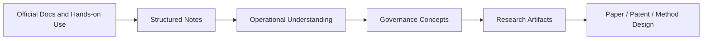
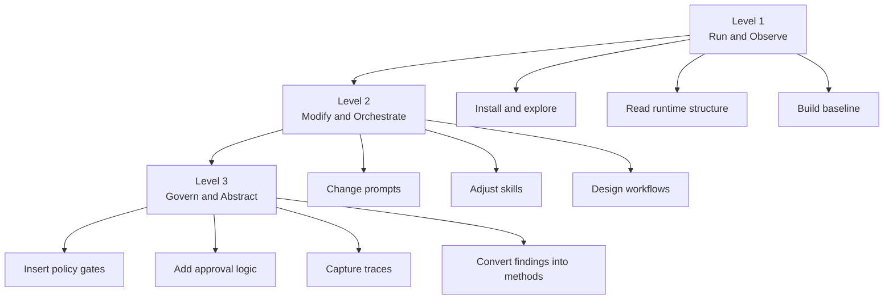
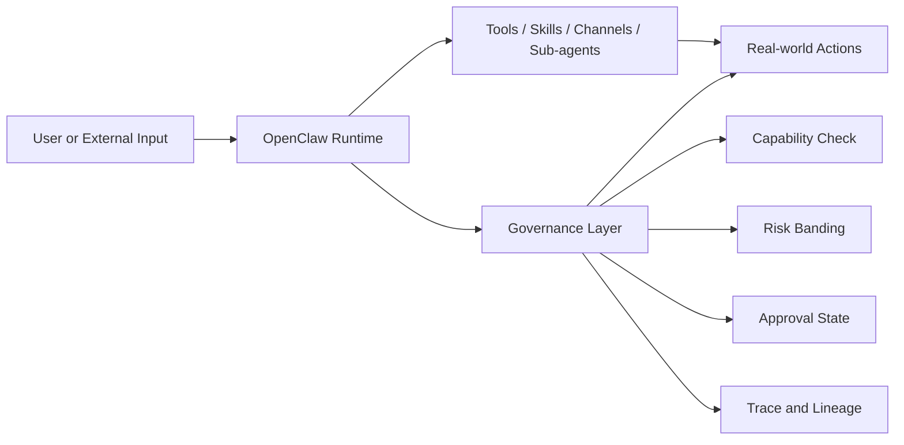

# 🧠 second-brain-openclaw

<p align="center">
  <strong>A research-oriented second-brain repository for learning, structuring, and extending OpenClaw.</strong>
</p>

<p align="center">
  <a href="https://github.com/JasonLn0711/second-brain-openclaw"></a>
  <a href="https://github.com/JasonLn0711/second-brain-openclaw"></a>
  <a href="https://github.com/JasonLn0711/second-brain-openclaw"></a>
  <a href="https://github.com/JasonLn0711/second-brain-openclaw"></a>
</p>

<p align="center">
  <a href="https://github.com/JasonLn0711/second-brain-openclaw"></a>
  <a href="https://github.com/JasonLn0711/second-brain-openclaw"></a>
  <a href="https://github.com/JasonLn0711/second-brain-openclaw/stargazers"></a>
</p>

## Overview

`second-brain-openclaw` is a documentation-first GitHub repository that treats OpenClaw not only as a tool to run, but as a system to understand, analyze, and eventually govern.

This repository is designed as a personal second brain for:

- learning how OpenClaw works as an agent runtime
- translating scattered knowledge into structured notes
- turning operational understanding into reusable research artifacts
- building a bridge from hands-on experimentation to governance, paper writing, and patent-oriented thinking

In short, this repo is not an OpenClaw source-code fork. It is a growing knowledge base for studying OpenClaw as a runtime, a workflow system, and a research platform.

## Quick Labels

| Label | Meaning |
| --- | --- |
| `Docs-First` | The repository is centered on Markdown documentation rather than implementation code. |
| `Second Brain` | Notes are meant to accumulate, connect, and become reusable over time. |
| `Research-Oriented` | The material is organized to support experiments, method design, and academic framing. |
| `OpenClaw-Focused` | The main subject is OpenClaw, especially its runtime, skills, memory, plugins, and governance implications. |
| `Early Stage` | The structure is still forming, so this README acts as both overview and direction-setting document. |

## Why This Repository Exists

Many people approach agent systems as demo tools. This repository takes a different path.

The goal here is to study OpenClaw through three increasing levels of maturity:

1. **Level 1: Run it**  
   Understand the runtime, the workspace, and the operational flow.

2. **Level 2: Modify it**  
   Learn how prompts, skills, channels, memory, and orchestration change behavior.

3. **Level 3: Govern it**  
   Frame OpenClaw as a platform for approval logic, traceability, security controls, and research-grade evaluation.

That progression is the core idea behind this repository.

## What This Repository Is

- A structured OpenClaw learning notebook
- A place to convert official documentation into practical understanding
- A future home for experiment logs, governance ideas, and security observations
- A repository for organizing paper-ready and patent-ready thinking around agent systems

## What This Repository Is Not

- Not the OpenClaw source repository
- Not a production deployment template
- Not a plugin implementation repo
- Not a finished documentation site
- Not a code-heavy engineering project at its current stage

## Repository Vision

This repository aims to grow from a simple note collection into a compact but rigorous knowledge system that connects:

- runtime literacy
- action and capability mapping
- threat and trust analysis
- governance design
- research abstraction



## Core Themes

The repo is built around five recurring themes:

### 1. Runtime Literacy

Understanding what OpenClaw actually is:

- gateway
- channels
- sessions
- workspace
- memory
- tools and skills

### 2. Surface Mapping

Studying what the system can do and where the meaningful action boundaries are:

- tool invocation
- file operations
- message generation
- memory persistence
- external-input handling

### 3. Structured Modification

Moving beyond "using" the system toward deliberate intervention:

- prompt changes
- skill adjustments
- configuration decisions
- multi-agent orchestration

### 4. Governance Insertion

Treating agent behavior as something that can be gated, reviewed, and traced:

- capability checks
- risk banding
- approval states
- lineage and trace capture

### 5. Research Translation

Turning engineering observations into:

- methodology
- experiments
- evaluation metrics
- paper sections
- patent-friendly claims and workflows

## Learning and Research Roadmap

Below is the current 14-day roadmap that this repository is designed to support.

| Day | Level | Theme | Key Output | Research Alignment |
| --- | --- | --- | --- | --- |
| 1 | L1 | Environment setup and first observation | A working OpenClaw baseline and initial runtime notes | Runtime baseline |
| 2 | L1 | Plugin and tool surface mapping | First capability inventory and attack-surface table | Capability mapping |
| 3 | L1 | Task-trace decomposition | A perceive-plan-act-persist trace sketch | Action boundary analysis |
| 4 | L1 -> L2 | Prompt, config, and skill changes | One small skill/config intervention with before-after notes | Rule-routing prototype |
| 5 | L2 | Multi-agent or sub-agent workflow study | A simple 2-3 agent pipeline | Orchestration evidence |
| 6 | L2 | Memory and persistence risk observation | A persistence-related risk scenario | Long-term risk framing |
| 7 | L2 | External input and channel analysis | An untrusted-input path model | Indirect input risk model |
| 8 | L2 | Hardened runtime comparison | A comparison between baseline and hardened setup | Secure-stack comparison |
| 9 | L2 -> L3 | Policy layer design | Capability, risk band, and approval schema | Governance architecture |
| 10 | L3 | Trace-gated action design | Observe -> propose -> approve -> commit flow | Traceable action control |
| 11 | L3 | Claim-oriented workflow prototype I | Input -> case match -> judgment routing | Patent method mapping |
| 12 | L3 | Claim-oriented workflow prototype II | Threshold and escalation logic | Escalation design |
| 13 | L3 | Evaluation framework | Baselines, ablations, and metrics | Reviewer-resistant methodology |
| 14 | L3 | Research package consolidation | System diagram, claim chart, and paper skeleton | Submission-ready framing |

## From Learning to Governance

The long-term value of this repository is not just "learning OpenClaw." It is learning how to turn an agent runtime into a governable and researchable system.



## Proposed Governance Stack

One of the central ideas behind this repository is that OpenClaw can be treated as a substrate for higher-level governance logic rather than as a standalone assistant shell.



This framing makes the repository useful not only for learning but also for:

- secure agent workflow design
- action-governance experiments
- traceability studies
- academic system design

## Repository Structure

### Current Structure

At the moment, the repository is still compact.

```text
second-brain-openclaw/
└── README.md
```

### Target Structure

As the repository grows, the structure is expected to evolve into something like this:

```text
second-brain-openclaw/
├── README.md
├── notes/
│   ├── week_1_notes.md
│   ├── week_2_notes.md
│   ├── workspace_and_memory.md
│   ├── plugin_and_tool_surface.md
│   └── security_and_governance.md
├── templates/
│   ├── daily_log_template.md
│   ├── experiment_template.md
│   └── review_template.md
└── diagrams/
    └── system_maps.md
```

## How to Use This Repository

If you are reading this repository for the first time, a practical order is:

1. Read this `README.md` to understand the scope and intent.
2. Use the roadmap to locate the stage you care about most.
3. Add or read notes that correspond to runtime learning, tool mapping, or governance design.
4. Treat every note as reusable building material, not just a temporary memo.

## Recommended Writing Pattern

To keep the repository coherent, future notes should ideally answer five questions:

| Field | Purpose |
| --- | --- |
| `Observation` | What did I see OpenClaw do? |
| `Threat` | What risk or trust issue appeared? |
| `Control` | What gate, policy, or safeguard could be inserted? |
| `Evidence` | What trace, log, comparison, or artifact supports the finding? |
| `Abstraction` | Can this become a method, metric, or claim? |

## Suggested Experiments

This repository is especially well-suited for experiments such as:

- persistence-oriented risk scenarios
- plugin capability minimization
- action approval workflows
- hardened-vs-baseline comparisons
- trace completeness and auditability studies

## Design Principles

The repository should continue to follow a few simple principles:

- keep notes reusable rather than overly conversational
- separate observation from inference whenever possible
- prefer diagrams and tables when they clarify system structure
- turn repeated patterns into templates
- write with enough precision that future research use remains possible

## Author

| Field | Information |
| --- | --- |
| Author | **Jason Chia-Sheng Lin** |
| Affiliation | **Institute of Biophotonics, NYCU** |
| Repository Role | Founder, maintainer, and primary note author |
| Focus | OpenClaw learning, agent governance, research framing, and structured technical note-taking |

## Status

> This repository is currently in an early documentation-building stage.  
> The README defines the direction; the note system will grow over time.

## Future Directions

Planned growth areas include:

- weekly learning notes
- OpenClaw subsystem summaries
- governance-layer concept drafts
- experiment logs and evaluation templates
- research-facing diagrams and structured artifacts

## Closing Statement

This repository is built on a simple idea:

OpenClaw should not only be used. It should be understood, documented, structured, and eventually governed.

That is what `second-brain-openclaw` is for.
